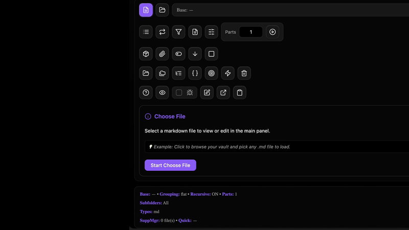

<div align="center">
  <a name="readme-top"></a>
  
  <h1 align="center">RANDOM FILE CONTROLS</h1>
  <h3 align="center"> Advanced Vault Compilation & Batch File Management IDE </h3>
</div>

<div align="center">
  <!-- TOP PURPLE LINKS -->
  <a href="https://beto.group"></a>
  <a href="https://discord.com/invite/6rDp4q4Y2B"></a>
  <a href="https://github.com/sponsors/beto-group"></a>
  <br/>
  <!-- BOTTOM GOLD TAXONOMY -->
  
  
  
  <hr>
</div>

<div align="center">
  
</div>

<div align="center">
  <p>
    <i> A comprehensive developer utility for batch file operations, advanced compilation, and vault management with an IDE-like interface. </i>
  </p>
  <hr style="width:30%;">
</div>

An all-in-one developer utility designed for complex file and folder operations within Obsidian. It functions as a powerful "Swiss Army knife" for developers, providing a rich UI for viewing, editing, compiling, and running batch operations on vault files. It includes multiple specialized modals for different tasks, from simple file compilation to advanced, rule-based batch processing.

---

## ✨ Features

*   🎯 **Universal Compile Engine**:
    *   **Simple Mode**: Quickly combine all files in a folder, with options for recursion and output format (MD, TXT, HTML).
    *   **Advanced Mode**: Offers fine-grained control, including splitting output into multiple parts, generating a table of contents, adding timestamps, and using templates.
    *   **Multi-Folder & JSON Modes**: Supports compiling files from multiple subfolders (grouped or separately) and runs compilations based on a user-provided JSON configuration.
*   📦 **Supplement Management**: Inject content from other files (as headers/footers) or copy files (like CSS or images) alongside compiled outputs.
*   ⚡ **Batch Operations**: Execute bulk commands on multiple selected files (Rename with patterns like `{name}-{index}`, Move, Delete, Copy, Archive, Tag additions/removals).
*   📁 **Integrated File Explorer & Editor**: Navigate the vault, create/rename/move/delete files, and edit raw text/markdown in a full-pane viewport.
*   ⤢ **Immersive Full-Tab Mode**: Reparents itself inside the active Obsidian leaf, automatically concealing the status bar and view footers for a distraction-free IDE experience.

---

## 🚀 Quick Start & Installation

1. **Get the Code**:
   * **Option A**: Clone directly into Obsidian vault directory:
     ```shell
     git clone https://github.com/beto-group/RandomFileControls
     ```
   * **Option B**: Extract repository ZIP into your Obsidian vault.
2. **Prerequisites**: Ensure the **Datacore** community plugin is active.
3. **Launch**: Open **`RANDOM FILE CONTROLS.md`** inside Obsidian.

---

## 📦 Directory Index & Components

The package exposes the following compiled files:

| File | Description |
| :--- | :--- |
| **[RANDOM FILE CONTROLS.md](RANDOM%20FILE%20CONTROLS.md)** | The main entry point designed to be loaded inside Obsidian panes. |
| **[src/index.jsx](src/index.jsx)** | View bootstrapper and cache invalidation daemon. |
| **[src/App.jsx](src/App.jsx)** | Main Random File Controls editor and compilation component. |
| **[data/mcp_commands.json](data/mcp_commands.json)** | Local polling command payload for HMR invalidation. |
| **[METADATA.md](METADATA.md)** | Packaging manifest outlining indexing, target, and security configurations. |
| **[CONTRIBUTION.md](CONTRIBUTION.md)** | Contributor architecture standards and local compilation guidelines. |
| **[LICENSE.md](LICENSE.md)** | MIT open-source license. |
